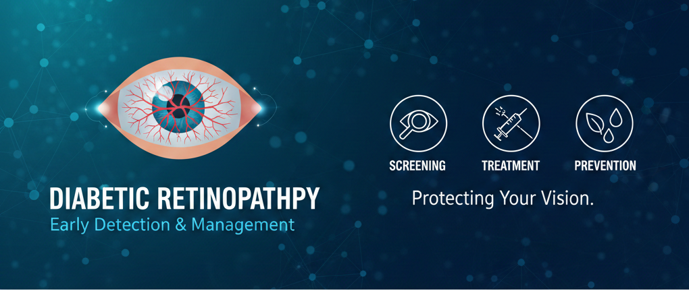
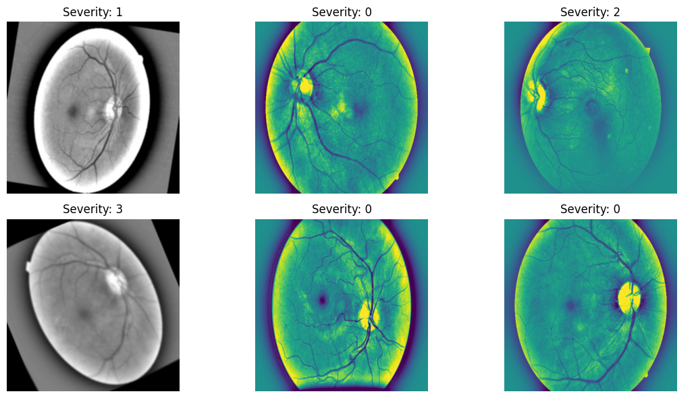
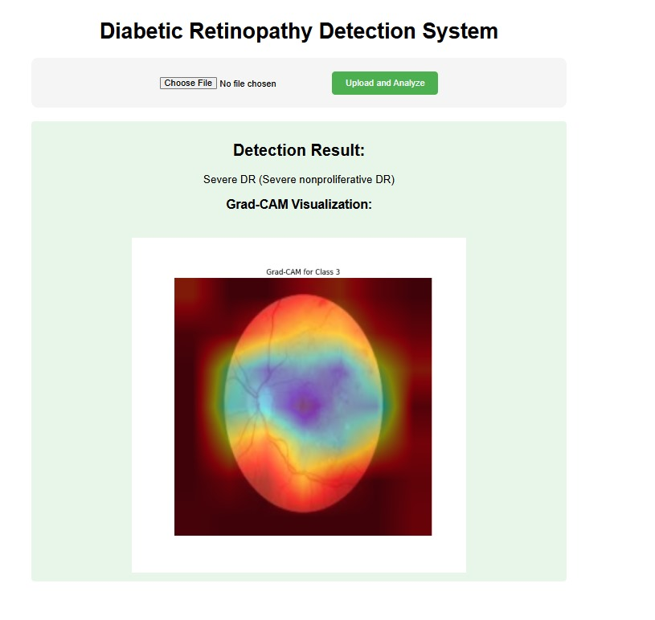

# Diabetic Retinopathy Classification System

A deep learning-based web application for classifying fundus eye images into different stages of diabetic retinopathy using ResNet50 architecture.

## Overview

This project implements an automated diagnostic system to detect and classify diabetic retinopathy from fundus photographs. The system uses a pre-trained ResNet50 convolutional neural network to classify images into 5 categories:

- **No_DR** - No Diabetic Retinopathy
- **Mild** - Mild stage
- **Moderate** - Moderate stage
- **Severe** - Severe stage
- **Proliferative_DR** - Proliferative Diabetic Retinopathy
## Project Structure

```
hacathon/
├── web_app.py              # Flask web application
├── classify.py             # Standalone classification script
├── best_model.pth          # Pre-trained ResNet50 model weights
├── requirements.txt        # Python dependencies
├── templates/
│   └── index.html          # Web interface
├── static/
│   └── uploaded_images/    # Directory for uploaded images
├── 1.png                   # Sample dataset image
├── resnet.png              # ResNet architecture diagram
├── result.png              # Localhost web application result
└── README.md
```

## Dataset

A sample of the dataset used for training can be seen in **1.png**.
 The dataset consists of high-resolution fundus photographs categorized into the 5 severity stages of diabetic retinopathy.

## Model Architecture

The classification model is built using **ResNet50** (Residual Network with 50 layers). A detailed architecture diagram is provided in **resnet.png** . The pre-trained ImageNet weights are fine-tuned with a custom fully-connected layer adapted for our 5-class classification task.

## Installation

1. **Clone or extract the project**
   ```bash
   cd f:\favourtes\Maqsood Data\GIKI 6 Semester\hacathon
   ```

2. **Create and activate virtual environment**
   ```bash
   python -m venv venv
   venv\Scripts\activate
   ```

3. **Install dependencies**
   ```bash
   pip install -r requirements.txt
   ```

## Usage

### Running the Web Application

Start the Flask web server:
```bash
python web_app.py
```

The application will be available at `http://localhost:5000`

#### Steps to Use:
1. Open your browser and navigate to `http://localhost:5000`
2. Upload a fundus eye image (JPG, PNG format)
3. Click "Classify" to get the prediction
4. View the classification result and uploaded image

**Web Application Interface**: See **result.png** for a visual example of the web application and its output on localhost.

### Running Standalone Classification

To classify images without the web interface:
```bash
python classify.py
```

## Results

The web application interface and sample classification results can be visualized in **result.png** , which shows the localhost interface with a classified fundus image and its predicted diabetic retinopathy stage.

## Documentation

For detailed information about the model training, methodology, evaluation metrics, and results analysis, please refer to the attached **project report in PDF**.

## Requirements

- Python 3.7+
- PyTorch
- Flask
- TorchVision
- PIL/Pillow

All dependencies are listed in `requirements.txt`

## Technical Details

- **Framework**: PyTorch
- **Model**: ResNet50 (pre-trained on ImageNet)
- **Web Framework**: Flask
- **Image Input Size**: 224×224 pixels
- **Output**: Classification with confidence score

## Future Enhancements

- Add real-time prediction feedback
- Implement batch image processing
- Deploy as REST API
- Add patient records management
- Implement sensitivity/specificity analysis

---

*Project developed for Hackathon at GIKI, 6th Semester*